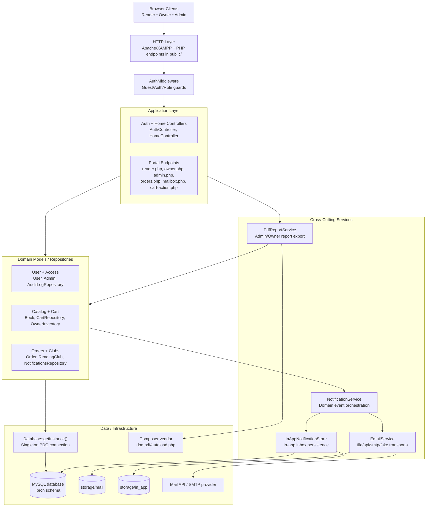

# IBRCN System Architecture

This diagram represents the current architecture implemented in the `ibrcn` application.

## Layer Notes

- Public endpoints in `public/` act as route handlers and compose dependencies.
- `AuthMiddleware` enforces guest/authenticated/role access before business operations.
- Controllers coordinate input/session flow and delegate data operations to models/repositories.
- Services handle cross-cutting workflows:
  - `NotificationService`: triggers email and in-app events.
  - `EmailService`: supports `file`, `api`, `smtp`, and `fake` transports.
  - `PdfReportService`: generates admin/owner PDF reports through Dompdf.
- `Database` provides a shared PDO connection to MySQL.

## Key Runtime Scenarios

1. Login/Register: `public/login.php` or `public/register.php` -> `AuthController` -> `User` model -> MySQL.
2. Cart/Checkout: `public/cart-action.php` + cart/order pages -> `CartRepository`/`Order` -> MySQL -> `NotificationService`.
3. Admin/Owner Reports: PDF endpoints -> `PdfReportService` -> Dompdf vendor libs -> streamed PDF response.
